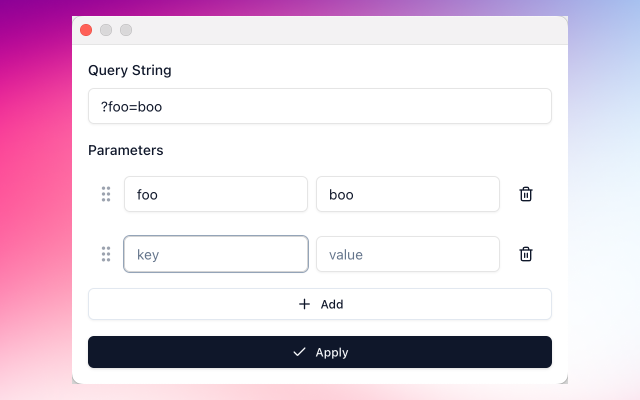

# Querify

A sleek browser extension that revolutionizes how you interact with URL query parameters. Whether you're a developer testing APIs or a user customizing URLs, Querify provides an intuitive visual interface for modifying query strings in real-time.

## Features

- 🔍 **Active Tab Integration**: Automatically loads and modifies query parameters from your current tab
- 🔄 **Drag-and-Drop Parameter Sorting**: Easily reorder query parameters with intuitive drag-and-drop functionality
- ➕ **Dynamic Parameter Management**: Add, remove, and modify query parameters with ease

## Usage

1. Click the Querify extension icon in your browser
2. View and edit the current URL's query parameters
3. Add new parameters using the "Add" button
4. Drag parameters to reorder them
5. Click "Apply" to update the URL with your changes

## License

MIT

## Author

torytang.025@gmail.com
